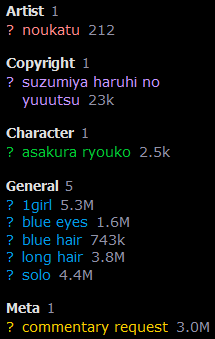

## Installation

- Install a userscript manager (Tampermonkey, Greasemonkey, Firemonkey, etc.)
- Click the "Install"/"Minified" link below the script you want below

## Danbooru Page Selector

[Install](https://github.com/ddmgy/userscripts/blob/master/danbooru-page-selector/dist/danbooru-page-selector.user.js?raw=true)

[Minified](https://github.com/ddmgy/userscripts/blob/master/danbooru-page-selector/dist/danbooru-page-selector.min.user.js?raw=true)

Adds a page selector to any page on Danbooru that has a paginator. Input a number and press Return key.

## Danbooru Show Profile Changes

[Install](https://raw.githubusercontent.com/ddmgy/userscripts/master/DanbooruShowProfileChanges.user.js)

Keep track of information on user profile, and displays the changes each time you reload the page.

## Danbooru - Panzoom on Posts

[Install](https://raw.githubusercontent.com/ddmgy/userscripts/master/Danbooru-PanzoomOnPosts.user.js)

Add panzoom to posts on Danbooru, just like the [media asset panzoom userscript by hdk5](https://github.com/hdk5/danbooru.user.js/blob/master/dist/mediaasset-panzoom.user.js).

## Danbooru - Show Tag Counts

[Install](https://github.com/ddmgy/userscripts/blob/master/danbooru-show-tag-counts/dist/danbooru-show-tag-counts.user.js?raw=true)

[Minified](https://github.com/ddmgy/userscripts/blob/master/danbooru-show-tag-counts/dist/danbooru-show-tag-counts.min.user.js?raw=true)

Show tag counts on Danbooru posts.

