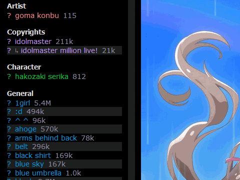
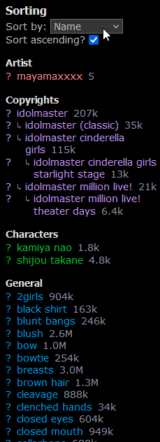

### Danbooru
* [Page Selector](#danbooru---page-selector)
* [Panzoom on Posts](#danbooru---panzoom-on-posts)
* [Rain Effects](#danbooru---rain-effect)
* [Show Profile Changes](#danbooru---show-profile-changes)
* [Show Tag Counts](#danbooru---show-tag-counts)
* [Sort Tags](#danbooru---sort-tags)
* [Upload Save Tags](#danbooru---upload-save-tags)

### Installation

- Install a userscript manager (Tampermonkey, Greasemonkey, Firemonkey, etc.)
- Click the "Install" / "Minified" link below the script you want to install

## Danbooru - Page Selector

[Install](https://github.com/ddmgy/userscripts/blob/master/packages/danbooru-page-selector/dist/danbooru-page-selector.user.js?raw=true)

[Minified](https://github.com/ddmgy/userscripts/blob/master/packages/danbooru-page-selector/dist/danbooru-page-selector.min.user.js?raw=true)

Adds a page selector to any page on Danbooru that has a paginator. Input a number and press Return key.

## Danbooru - Panzoom on Posts

[Install](https://github.com/ddmgy/userscripts/blob/master/packages/danbooru-panzoom-on-posts/dist/danbooru-panzoom-on-posts.user.js?raw=true)

[Minified](https://github.com/ddmgy/userscripts/blob/master/packages/danbooru-panzoom-on-posts/dist/danbooru-panzoom-on-posts.min.user.js?raw=true)

Add panzoom to posts on Danbooru, just like the [media asset panzoom userscript by hdk5](https://github.com/hdk5/danbooru.user.js/blob/master/dist/mediaasset-panzoom.user.js).

## Danbooru - Rain effect

[Install](https://github.com/ddmgy/userscripts/blob/master/packages/danbooru-rain-effect/dist/danbooru-rain-effect.user.js?raw=true)

[Minified](https://github.com/ddmgy/userscripts/blob/master/packages/danbooru-rain-effect/dist/danbooru-rain-effect.min.user.js?raw=true)

Add animated rain effect over posts on Danbooru, inspired by the [pixiv rain seasonal effect](https://dic.pixiv.net/en/a/pixivRain2024).

## Danbooru - Show Profile Changes

[Install](https://github.com/ddmgy/userscripts/blob/master/packages/danbooru-show-profile-changes/dist/danbooru-show-profile-changes.user.js?raw=true)

[Minified](https://github.com/ddmgy/userscripts/blob/master/packages/danbooru-show-profile-changes/dist/danbooru-show-profile-changes.min.user.js?raw=true)

Keep track of information on user profile, and displays the changes for the current day (since midnight).

## Danbooru - Show Tag Counts

[Install](https://github.com/ddmgy/userscripts/blob/master/packages/danbooru-show-tag-counts/dist/danbooru-show-tag-counts.user.js?raw=true)

[Minified](https://github.com/ddmgy/userscripts/blob/master/packages/danbooru-show-tag-counts/dist/danbooru-show-tag-counts.min.user.js?raw=true)

Show tag counts on Danbooru posts.

## Danbooru - Sort Tags

[Install](https://github.com/ddmgy/userscripts/blob/master/packages/danbooru-sort-tags/dist/danbooru-sort-tags.user.js?raw=true)

[Minified](https://github.com/ddmgy/userscripts/blob/master/packages/danbooru-sort-tags/dist/danbooru-sort-tags.min.user.js?raw=true)

Sort tag lists by name or post count.

## Danbooru - Upload Save Tags

[Install](https://github.com/ddmgy/userscripts/blob/master/packages/danbooru-upload-save-tags/dist/danbooru-upload-save-tags.user.js?raw=true)

[Minified](https://github.com/ddmgy/userscripts/blob/master/packages/danbooru-upload-save-tags/dist/danbooru-upload-save-tags.min.user.js?raw=true)

Save/load information on upload page. Information is deleted when loading a post for a given media asset, or after 5 days.
